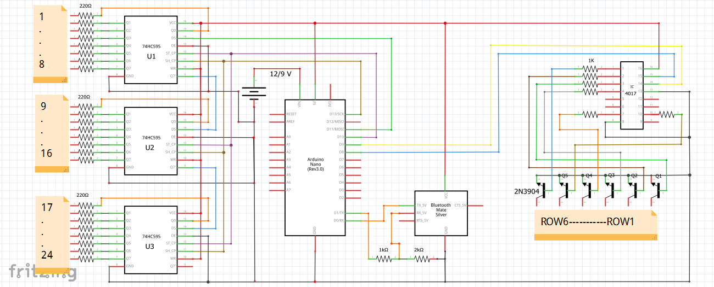

# 📟 Wireless Scrolling LED Matrix Display (6×24)
## 📌 Overview

This project is a wireless scrolling LED matrix display (6×24) built using an Arduino Uno. The system allows real-time text display on an LED matrix via a mobile device using Bluetooth communication._

_It demonstrates embedded systems concepts such as shift registers, multiplexing, and wireless data transmission.

## 🚀 Features
* 📶 Wireless text transmission using Bluetooth (HC-05)
* 🔁 Real-time scrolling display
* 💡 Efficient LED control using shift registers
* 🔌 Multiplexing technique for reduced pin usage
* ⚡ Low-cost and compact design

## 🧰 Components Used
### 🔩 Hardware Components
* Arduino Uno
* HC-05 Bluetooth Module
* 74HC595 Shift Register IC
* CD4017 Decade Counter (Multiplexer)
* 2N3904 Transistors (6x)
* LEDs (144x, Blue)
* Resistors: 220Ω (24x), 1kΩ (6x), 2kΩ (1x)
* PCB Board
* Jumper Wires
* 9V Battery / Power Bank

## ⚙️ Working Principle
### 🔁 Multiplexing (IC 4017)

The CD4017 acts as a decade counter and controls row scanning in the LED matrix. It receives clock pulses and activates one output at a time, enabling multiplexed display control.

### 🔄 Shift Register (74HC595)

The 74HC595 is used to expand output pins of the Arduino. It converts serial data from the microcontroller into parallel output to drive LED columns efficiently.

### 🔋 Transistor Switching

The 2N3904 transistors are used to amplify current and switching, allowing proper brightness and safe operation of LEDs.

### 📡 Wireless Communication

The HC-05 Bluetooth module receives data from a mobile device and sends it to the Arduino for processing and display.

## 🖥️ System Architecture
1. Mobile app sends text via Bluetooth
2. HC-05 receives the data
3. Arduino processes the data
4. 74HC595 controls LED columns
5. CD4017 scans rows using multiplexing
6. LEDs display scrolling text

## 🛠️ Software
* Arduino IDE
* Embedded C / Arduino Programming

## ▶️ How to Use
1. Connect all components as per the circuit diagram
2. Upload the .ino file to Arduino using Arduino IDE
3. Pair your mobile device with HC-05
4. Send text via a Bluetooth terminal app
5. Watch the text scroll on the LED matrix

## 📸 Project Images

### 🔌Circuit Diagram

## 📚 Applications
* Digital notice boards
* Advertising displays
* Information systems
* Embedded system learning projects